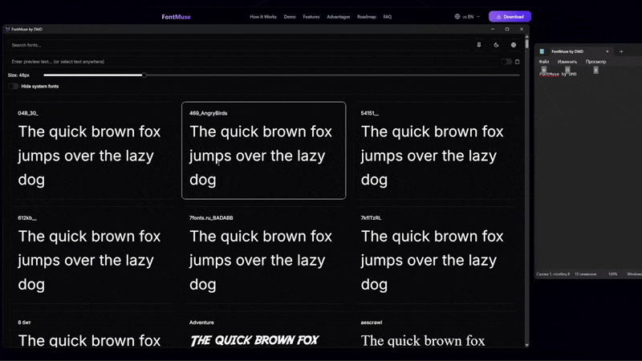

# FontMuse ✨

<p align="center">
  <strong>A sleek, modern font manager and preview tool for Windows, built with Rust, Tauri 2.0, and Next.js.</strong>
</p>

<p align="center">
  
  
  
</p>

---

<p align="center">
  
</p>

**FontMuse** provides an intuitive interface for browsing, searching, and previewing system fonts. It's designed for developers, designers, and anyone who works with typefaces, offering powerful features like real-time clipboard monitoring and extensive customization options in a secure, high-performance desktop application.

## 🚀 Key Features

-   **👁️ Live Font Preview**: Instantly see how your text looks in any system font.
-   **📋 Live Clipboard Monitoring**: Automatically previews text you copy from **any** application.
-   **⚡ Blazing Fast**: Built with Rust on the backend for native performance.
-   **🎨 Modern UI**: Beautiful and responsive interface built with Next.js and shadcn/ui.
-   **🎚️ Full Customization**: Adjust font size, change preview text, and filter fonts in real-time.
-   **🌗 Light & Dark Themes**: Syncs with your system theme or choose your preference.
-   **🌍 Multi-language Support**: Fully localized for English and Russian.
-   **🔒 Secure by Design**: Leverages Tauri's capability-based security model. No telemetry, all data stays on your machine.
-   **📌 Always-On-Top**: Pin the window to keep it visible for easy comparison.

## 📥 Download

Get the latest version of FontMuse for Windows from the official releases page.

| File Type | Description | Download |
| :--- | :--- | :--- |
| **`.msi`** | **Installer (Recommended)** | <a href="https://github.com/Cr1ator/FontMuse/releases/latest">Latest Release</a> |
| **`.exe`** | Standalone Installer | <a href="https://github.com/Cr1ator/FontMuse/releases/latest">Latest Release</a> |
| **`.zip`** | Portable Version | <a href="https://github.com/Cr1ator/FontMuse/releases/latest">Latest Release</a> |

## 🛠️ Technology Stack


## 👨‍💻 For Developers

Interested in contributing or running the project from source? We'd love your help!

### Development Setup

1.  **Clone the repository:**
    ```bash
    git clone https://github.com/Cr1ator/FontMuse.git
    cd FontMuse
    ```

2.  **Install dependencies:**
    ```bash
    pnpm install
    ```

3.  **Start the development server:**
    This will launch the application in development mode with hot-reloading.
    ```bash
    pnpm tauri dev
    ```

4.  **Build for production:**
    ```bash
    pnpm tauri build
    ```

### Project Structure

The project is organized into two main parts: the Rust backend (`src-tauri`) and the Next.js frontend (`./`).

```FontMuse/
├── src-tauri/           # Rust backend (Tauri)
├── app/                 # Next.js frontend (React)
├── components/          # UI Components
├── lib/                 # Utilities & Configs
└── locales/             # Translation files
```

### Contributing

Contributions are welcome! Please feel free to open an issue to discuss a new feature or submit a pull request.

## 📄 License

This project is licensed under the MIT License. See the [LICENSE](LICENSE) file for details.